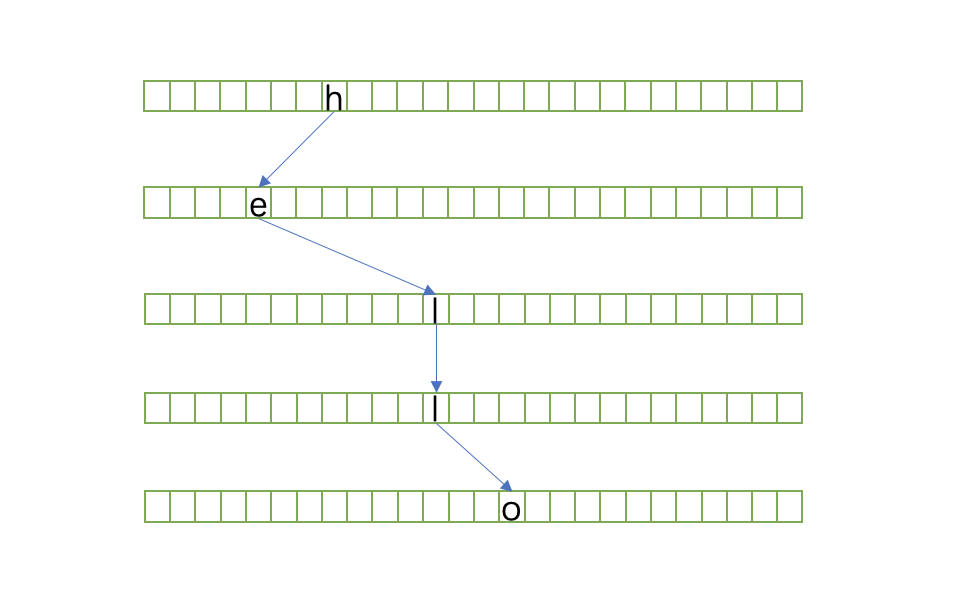
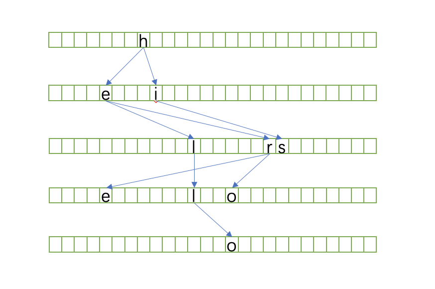
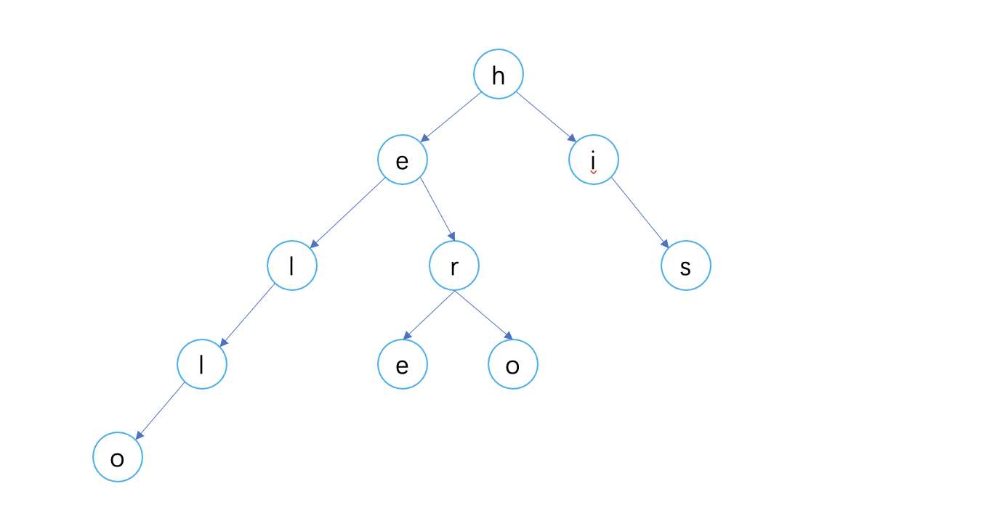

::: tip 题目描述：
Trie（发音类似 "try"）或者说 前缀树 是一种树形数据结构，用于高效地存储和检索字符串数据集中的键。这一数据结构有相当多的应用情景，例如自动补完和拼写检查。  
请你实现 Trie 类：  
- Trie() 初始化前缀树对象。
- void insert(String word) 向前缀树中插入字符串 word 。
- boolean search(String word) 如果字符串 word 在前缀树中，返回 true（即，在检索之前已经插入）；否则，返回 false 。
- boolean startsWith(String prefix) 如果之前已经插入的字符串 word 的前缀之一为 prefix ，返回 true ；否则，返回 false 。
:::

## Trie
一般指字典树，又称单词查找树，Trie树，是一种树形结构，是一种哈希树的变种。典型应用是用于统计，排序和保存大量的字符串（但不仅限于字符串），所以经常被搜索引擎系统用于文本词频统计。它的优点是：利用字符串的公共前缀来减少查询时间，最大限度地减少无谓的字符串比较，查询效率比哈希树高。  
Trie是一棵非典型的多叉树，多叉树，顾名思义，每个节点可能存在多个子节点。之所以说它是`非典型`的，是因为它和一般的多叉树不太一样，尤其是在节点的数据结构设计上，常见的多叉树一般是这样的：  
```javascript
const tree = {
    val: 1,
    children: [
        {
            val: 2,
            children: [
                {
                    val: 4,
                    children: []
                }
            ]
        },
        {
            val: 3,
            children: []
        }
    ]
}
```
而Trie的结构是这样的（针对本题而言，节点数据只包含`a-z`的小写字母，这里每个节点都列出了26个字母的映射，实际情况只需要保存存在的字母的映射即可，举个例子：对于字符串`a`，它只包含一个成员`a`，所以根节点只需要保存属性`a`即可，而属性`a`的值只需要用`isEnd: true`来标记结束即可）：  
```javascript
const trie = {
    isEnd: false,
    a: {
        isEnd: false,
        a: {
            isEnd: true
        },
        b: {},
        ...,
        z: {}
    },
    b: {
        isEnd: true
    },
    c: {},
    ...,
    y: {},
    z: {}
}
```
每个节点除了包含`isEnd`字段外，还包含26个字母的映射关系，各子节点的结构也是如此。但Trie中并没有直接保存任何值，比如对于字符串`hello`而言，Trie树并没有保存它的任何字符成员，那它是怎么保存字符串`hello`的呢？  
它的真实情况是这样的：  

如果同时保存`here`、`hero`、`his`呢？

在构建一棵单词查找树时，我们一般会忽略空节点，简化一下，可以用下面的方式表示：

可以看到，各节点连起来的路径就是实际保存的值，每个节点保存了下一个可能出现的所有字符的连接，所以，通过一个父节点即可得到它所有可能的子节点。

## 使用`JavaScript`来实现一个简单的Trie

### 定义Trie构造函数
```javascript
// 初始化数据结构，用对象来表示树结构
const Trie = function() {
    this.node = {};
}
```

### 实现`insert`方法
通过insert方法向树中插入字符串，不需要返回值。此方法接受一个字符串参数`word`，只需要遍历字符串，将字符串的成员依次插入树中，遍历结束后，将该字符串的最后一个成员节点的`isEnd`标记为`true`，表示该节点是一个路径的终点，当然其他字符串也可以以该节点为终点。
```javascript
/**
 * 向节点中插入字符串
 * @param {string} word
 * @return {void}
 */
Trie.prototype.insert = function(word) {
    let node = this.node;
    // 遍历字符串
    for (const char of word) {
        // 成员节点不存在时，创建节点
        if (!node[char]) {
            node[char] = {};
        }
        // 指向下一个节点，依次创建字符串“路径”
        node = node[char];
    }
    // 标记路径终点
    node.isEnd = true;
}
```

### 实现`searchPrefix`方法
通过`searchPrefix`方法查找前缀字符串，如果存在该前缀，则返回路径终点，否则返回`false`。
举个例子：如果已经向树中插入字符串`apple`，字符串`apple`的完整路径为`a-p-p-l-e`，则字符串`a`、`ap`、`app`、`appl`、`apple`均为`apple`的前缀，`appla`则不是。
```javascript
/**
 * 查询前缀
 * @param {string} prefix
 * @return {boolean|object}
 */
Trie.prototype.searchPrefix = function(prefix) {
    let node = this.node;
    for (const char of prefix) {
        if (!node[char]) {
            return false;
        }
        node = node[char];
    }
    return node;
}
```

### 实现`search`方法
通过`search`方法检索树种是否已经插入该字符串，注意是是否已经插入，而不是是否存在该前缀，返回布尔值。
可通过`searchPrefix`方法查找前缀，存在该前缀且路径终点`isEnd`字段为`true`。
```javascript
/**
 * 检索树中是否存在字符串word
 * @param {string} word
 * @return {boolean}
 */
Trie.prototype.search = function(word) {
    const node = this.searchPrefix(word);
    // 注意返回布尔值，isEnd可能为undefined
    return node && !!node.isEnd;
}
```

### 实现`startsWith`方法
查找是否存在前缀，如果已经插入字符串`apple`，则它的所有子路径都为合法前缀。
```javascript
/**
 * prefix是否为某个已插入字符串的前缀
 * @param {string} prefix
 * @return {boolean}
 */
Trie.prototype.startsWidth = function(prefix) {
    const node = this.searchPrefix(prefix);
    return !!node;
}
```

## 总结：
通过以上的介绍和代码实现，可以简单总结出Trie的几点性质：
- Trie的形状和单词插入顺序无关，只要给定一组确定的单词，则树的形状就确定了；
- 查找一个长度为L的单词，最多查找`L+1`次，与当前树中存储了多少单词无关；
- Trie的每一个节点中都保存了26个（或其他字母表，则不一定是26个）字母属性，这很浪费空间。如果树的高度是n，字母表的大小为m，则空间复杂度为O(m<sup>n</sup>)。  
<strong>最后，关于Trie的应用场景，一次建树，多次查询，拿空间换时间。</strong>  
  
  
<font color="#bfbfbf">以上都是基本操作，更深层次的理解，还得靠你自己去探索。~_~</font>