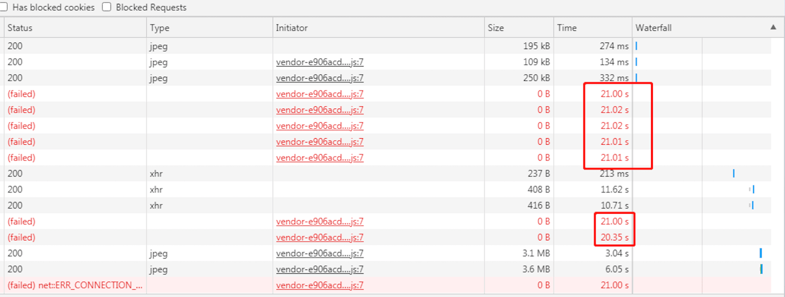
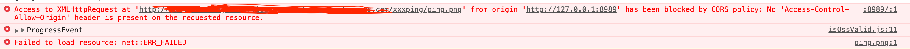

## 问题出现
一个考试相关的项目，`Electron + Vue`技术栈，客户端部署在学校机房，web端部署在线上，项目中的图片存储在阿里OSS，此为背景。  
前几天进行了一次考试，刚一开始就接到反馈说有多个学校打开试卷之后看不到图片，所有的图片都“裂开了”，由于考试挺重要，学校方面都比较重视，师生们急的都快“裂开了”，听到这个反馈，嗡的一下，我也差点“裂开了”...

## 紧急排查
### 是不是服务挂了？
第一反应就是服务器是不是出问题了，但转念一想，由于各学校机房优先使用的都是客户端，web端不经后台配置是无法访问的，而客户端里的静态页面都是打在包里的，都在本地，没理由访问不到。后端同学检查了一下，各项指标都正常，稍稍放心了点。    
又向学校方面确认了一下是只有图片看不到还是啥都看不到（没接触过的话肯定想象不到，部分地区学校的师生，计算机知识真的很差，有的连浏览器都不会打开，有的会打开却不知道地址栏是啥，沟通起来非常痛苦），好在百般引导下，又是拍照片又是视频，终于确认了：**客户端是正常的，只有图片全挂了**。
### 那这是OSS挂啦？
本着对阿里的信任，还是不愿意往这方面想的，但排查还是必要的。  
打开OSS客户端，找到当前正在使用的试卷中的一个图片，复制地址，扔到浏览器，正常！我说呢，OSS咋可能挂掉嘛，哈哈（手动狗头）。  
既然OSS是正常的，我们这边可以正常访问，用户那边不能访问，**一定是用户的问题！**（再次狗头），目前距离考试开始已经将近十分钟了，全国同时有一万多所学校在同时考试，接到的反馈还是那几所学校有问题，这就说明大多数学校是没有问题的。
### 找到原因
继续跟出现问题的学校沟通，把我们这边可以正常访问的图片地址发过去，并引导他们使用浏览器打开该图片，**无法访问**！果然是他们的问题，但为什么不能访问呢？如果机房限制访问外网的话，那接口是怎么调通的，他们是已经登录了的。  
长时间跟学校机房打交道，一些常见的问题基本都知道怎么去排查，至于这个问题嘛，就得问问机房管理员了，是不是设置了IP白名单或是其他限制，接下来的沟通也验证了这个问题，这个“罪魁祸首”啊，把我们吓的不轻。

## 临时方案
别想着让用户解决问题（比如让机房管理员重新配置一下之类的），还是得靠我们自己。  
经过技术部讨论，决定临时放开web端访问限制，通过我们自己的服务器去访问图片，每个图片都有名称，后端同学提供接口，根据图片名称获取对应的图片，前端替换图片地址。  
方案确定之后，我不禁“窃喜”，因为试卷中的图片都没有直接使用`img`标签，而是用组件又包了一层，当时是考虑到后续能会有设置排版、自定义样式的需求，所以留了个扩展，没想到今天派上用场了，真是佩服我当时的机智啊，哈哈。  
既然已经将`img`都抽取出来了，那前端的改动就小了呀，改个`src`就完事儿：
```html

<!-- 改为 -->

```
改完提交，测试通过，`hotfix`走起，线上验证没有问题之后把地址给了学校，终于在他们“裂开”之前，把可能出现的“悲剧”扼杀在了摇篮里。最终，当天的考试再没有起波澜，数据收集、整理、交付，“顺利”完成任务。

## 彻底解决问题
### 复盘
复盘时大家针对这次的问题做了充分的讨论：  
有的认为无伤大雅，因为学校机房环境非常复杂，软硬件十分落后，作为相对正式的考试，学校方面理应对机房进行提前设置和问题排查，来适应考试系统；  
有的认为这是对系统的一次考验，在稳定性和兼容性上又前进了一步；  
而大部分同学的观点是一致的，问题就是问题，我们应该正视它，解决它，并在以后的迭代中更加注重产品的兼容和稳定，以适应机房复杂的环境，而不是让用户帮我们解决问题。  
不禁想起了BG反复要求的：  
**面向失败设计，保持风险意识，拥有底线思维。**  
**教育业务高并发和海量用户场景下，应时刻保持高敏感度和风险意识，避免轻微或偶现问题被放大。对内外部的依赖，须做可信度评估、风险识别、失败设计。**

### 复现问题
各种复杂环境最终导致的结果只有一个，OSS无法访问，那我们就可以通过修改hosts文件来模拟这个“无法访问”。  
MAC下通过以下命令打开hosts文件：
```bash
open /etc/hosts
```
**注意，修改时如果提示没有权限，可以复制一份出来，修改完之后覆盖源文件。**  
改完之后立竿见影，OSS无法访问了，可以进行下一步了。
### 初步修复
```html
<!-- 在vue中 -->

```
```js
onError() {
    this.loading = true;
    this.src = `${publicUrl.getImage}?imgName=${this.imgObj.name}`;
    try {
        if (process.env.NODE_ENV === 'production') {
            // 生产环境屏蔽图片报错信息
            console.clear();
        }
    } catch(e) {
        console.log(e);
    }
},
onLoad() {
    this.loading = false;
}
```
`img`标签加载图片失败时，控制台会报错，错误信息中包含图片的具体地址，看起来非常不雅，而且这个报错无法屏蔽，为了控制台好看些，“相对”安全些，那就在生产环境下清空控制台。  
自测了一下，看到oss地址报错之后，`img`地址被替换成了接口地址，而且图片正常展示了，大功告成，提交测试。  
### 再出问题
啪，打脸来的异常的快，测试同学很勤奋嘛！这么快就提了新bug，让我看看，改了这么几行代码，能整出来啥bug，打开禅道，发现有一个图片访问等待时间较长的bug，测试妹子还细心的把控制的截屏贴了上去，**长达21s**，图片倒是能显示，就是响应太慢啊：

排查了一下，最终发现，代码没有问题，优先访问OSS，失败后访问我们自己的服务器，问题是OSS的响应也太慢了，一直是挂起状态，20s后才报了个错误，时间都浪费在这上面了。为啥我这边响应这么快呢？跟测试妹子深入沟通了一下，发现我这边设置的是`127.0.0.1`，她是随便写的...**妙啊**
### 再复现问题
既然IP地址不一样，响应时间也不一样，那就来个极端点的，直接设置成`254.253.252.251`，好家伙，**长达21s**已经说明不了问题了，我这直接**长达两分钟**。
### 彻彻底底解决
既然能通过修改hosts文件模拟出两分钟没响应的情况，真实的用户环境可能会出现更多的问题吧！那就有必要把这个时间往长了考虑。  
对于特殊配置后的域名响应慢的问题，前端是没办法直接干预的，只能另辟蹊径，这个时候我灵光一闪想到了缓存。何不先`ping`一下呢？如果在用户刚打开页面或者手动刷新页面的时候`ping`一下OSS域名，再把结果缓存起来，下次不就能直接用了嘛！咋`ping`呢？`ajax`呗，哈哈，我这自问自答厉害了吧！  
说干就干，我有个小习惯，总是会用最简单的方式测试一下可行性，比如万一`ajax`访问不到OSS呢？
```js
const xhr = new XMLHttpRequest();
xhr.open('GET', IMG_SRC);
xhr.send();
xhr.onerror = e => {
    console.error(e);
}
```

你看看，我这该死的小习惯，跨域了啊，这条路走不通了，看来还是得用`img`啊。
```js
// 检测OSS是否被禁用
function check() {
    // ajax访问会存在跨域问题
    const img = document.createElement('img');
    img.src = IMG_SRC;
    img.onload = () => {
        localStorage.removeItem(STORAGE_KEY);
    }
    img.onerror = () => {
        localStorage.setItem(STORAGE_KEY, true);
    }
}
// oss是否可用，获取上一次的检测结果，默认可用
function getOssIsValid() {
    return !localStorage.getItem(STORAGE_KEY);
}
export {
    check,
    getOssIsValid
}
```
只在访问不通的时候记录，默认情况和访问通的情况都视为OSS可用。使用图片的时候再进行判断：
```js
getImgUrl() {
    // 优先使用oss
    if (getOssIsValid()) {
        this.src = this.imgObj.url;
    } else {
        this.src = `${publicUrl.getImage}?imgName=${this.imgObj.name}`;
    }
}
```
剩下的唯一一个问题就是，在`ping`通OSS之前，我们仍然优先访问OSS，所以有可能访问图片仍然很慢，但之后有了缓存，从服务器获取就会快很多。  
为什么不直接从服务器获取呢？OSS可是花了钱的，正常情况下响应速度很快，为什么不用呢？  
对于真实的用户环境，像这种IP设置或hosts文件修改是非常低频的事，一旦有了缓存，便能极大的提升用户体验。

## 总结
**面向失败设计，保持风险意识，拥有底线思维。**