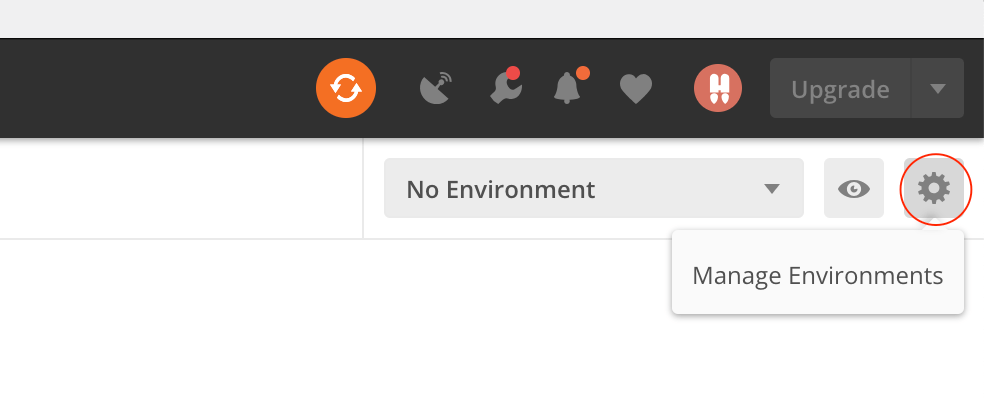
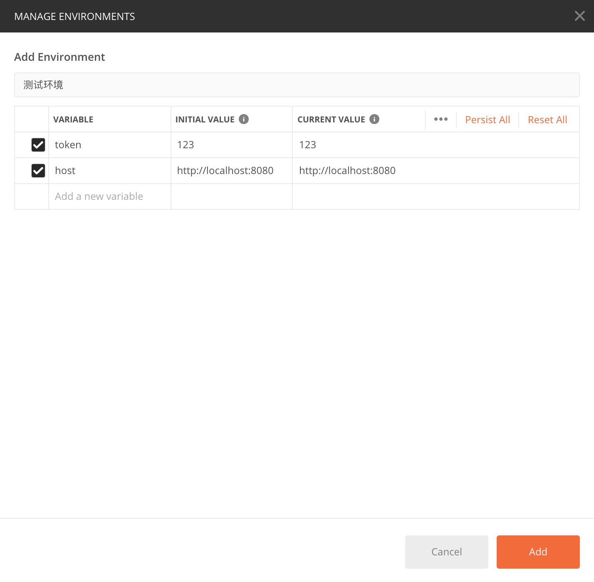
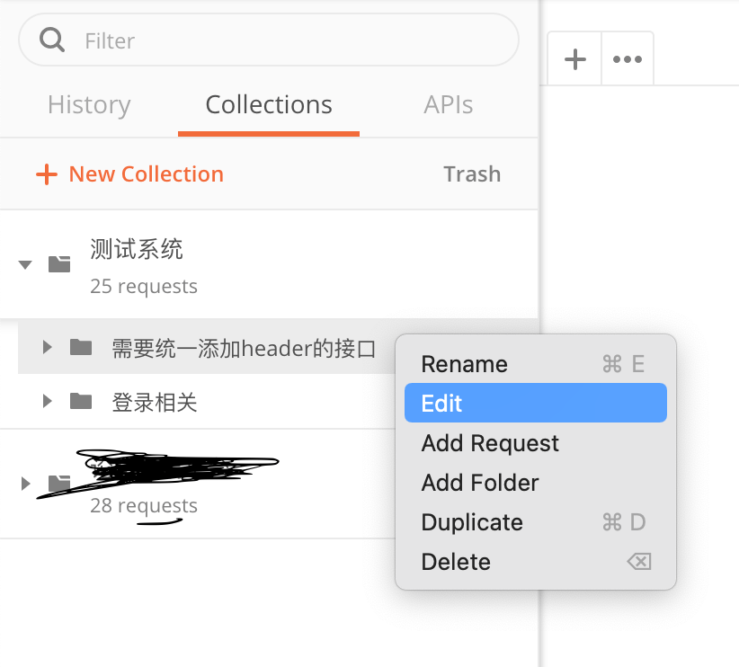
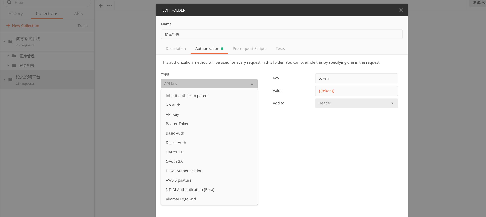
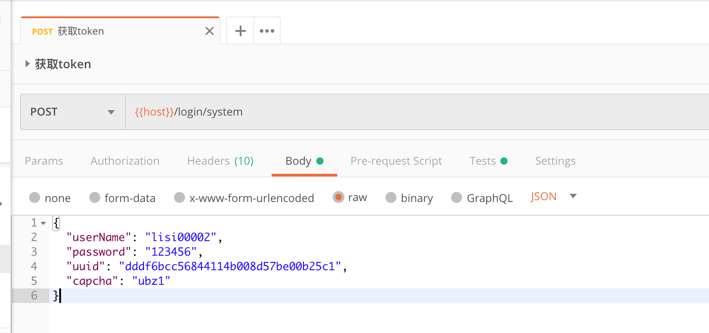
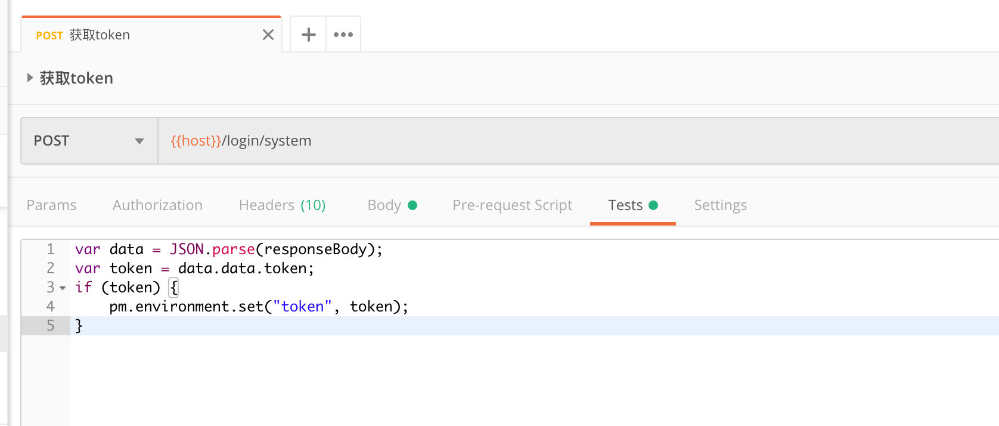

## 应用场景
使用Postman调试接口时，需要在多个接口添加统一的参数、请求头字段，如：使用jwt登录鉴权时，需要在请求头里添加token字段，挨个接口加的话，实在是太费劲了，而且一旦token有更新，简直不能更难受。  
那么就需要一种方式，能统一的给接口添加请求头或参数，并且更新起来要很方便。

## 具体操作

### 设置环境变量

#### 1、点击右上角设置按钮，打开环境变量设置弹窗


#### 2、添加具体变量
如下图，当前环境名称为**测试环境**，包含两个变量，一个`token`用来鉴权，一个`host`用来表示服务地址。服务地址手动更新就可以了，token的话，一般都是从接口获取的，设置成自动更新会方便些，后面会有更新token的方法介绍。添加完成之后点击右下角的`Add`就可以了。


#### 3、切换环境
点击下拉框，选择刚刚设置的环境，上一步设置的变量才能够使用。


### 统一添加请求头
把需要统一添加请求头的接口放到一个文件夹里，方便统一设置。在文件夹标题处鼠标右键或者点击“更多”图标，然后在下拉选项中选择编辑。

可以看到type下拉框里内置了一些类型，根据自己需求选择。我们当前系统使用jwt鉴权，token放在请求头里，字段名称为`token`，所以这里选择了`API Key`选项，自定义key、value以及添加到的位置。  
`Key`设置为`token`，`Value`通过`{{token}}`引用环境变量，`Add to`选择`Header`，因为我要添加到请求头里，还可以选择`Query Params`，添加到请求路径参数里。  
点击保存，则当前文件夹下的所有接口就统一添加了请求头。


### 更新环境变量
#### 1、常量更新，如`host`，手动更新就可以了

#### 2、变量更新
对于`token`来说，一般是通过接口获取的，那就可以在获取token的时候，把结果取出来，自动更新。  

切换到`Tests`选项卡，写入以下代码：
```js
var data = JSON.parse(responseBody);
// 取出响应结果中的token，具体要看你的数据格式
var token = data.data.token;
if (token) {
    // 更新token变量
    pm.environment.set("token", token);
}
```
token接口响应之后，这段代码会从响应结果中取出token，并更新环境变量。


## 总结
- 1、给当前的项目设置环境变量，当然也可以使用全局变量，但是项目一旦多的话，变量怕是不好区分；
- 2、将需要统一设置的字段加到环境变量里；
- 3、将需要添加同样字段的接口放到一个文件夹下，统一设置字段，值引用环境变量中的值；
- 4、更新时，如果值需要从后端获取，则可在获取值的接口中，通过代码更新环境变量。  
**整个流程就通了。**