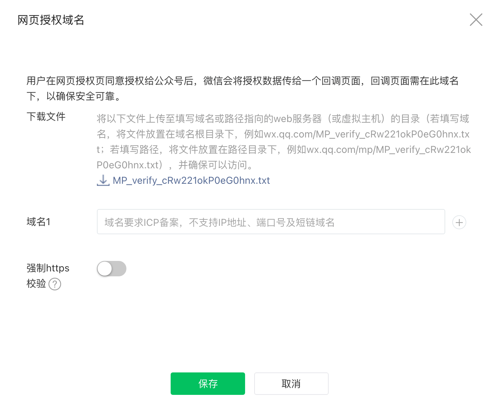
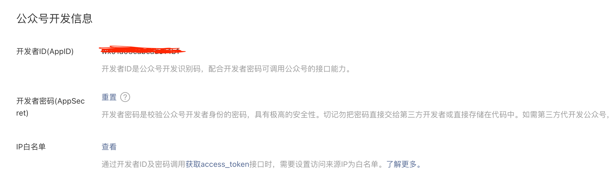
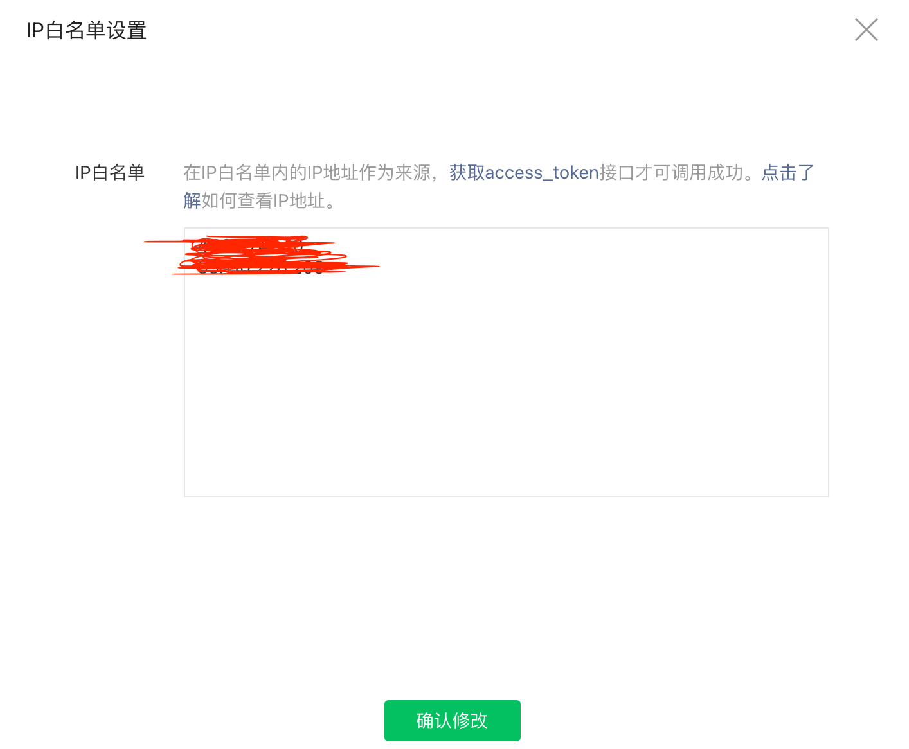

## 公众号网页授权
一般指**如果用户在微信客户端中访问第三方网页，公众号可以通过微信网页授权机制，来获取用户基本信息，进而实现业务逻辑。**[文档](https://developers.weixin.qq.com/doc/offiaccount/OA_Web_Apps/Wechat_webpage_authorization.html)  
当然还有其他一些接口，比如获取用户地理位置、申请使用麦克风等，也需要用户授权才能使用，这些可以理解为申请权限，这里主要介绍前者，当然对于JS-SDK的使用方法及相关配置都是通用的。

## 准备“材料”
- 一个已经通过**微信认证**的**服务号**，对于网页授权获取用户信息，必须满足这个条件，至于其他接口权限，可查看[文档](https://mp.weixin.qq.com/advanced/advanced?action=table&token=2100413425&lang=zh_CN)
- 确保你的域名已经通过**ICP备案**
- 给你的微信号设置尽可能高的权限（对于你要开发的公众号），否则后续协调管理员扫码授权会给你带来无尽的折磨（对于中大型公司，或跨BU、BG等情况，非常浪费时间）
- 如果你是全栈工程师，可忽略这条，否则提前知会你们的后端同学，这个是需要他们全程配合的

## 公众号后台配置
### 1、设置网页授权域名
如未配置网页授权域名，获取code时，会报redirect_uri异常。
登录公众号后台，依次找到**设置与开发-公众号设置-功能设置**，点击网页授权域名后的设置按钮：  

其实就是做个验证，把这个txt文件下载下来，放到域名根节点，就是通过yourdomain.com/xxxx.txt可以访问到这个txt文件（或者是放到某个路径下，如yourdomain.com/test/xxxx.txt），输入你的域名或路径，点击保存就可以了。

### 2、配置ip白名单
早些时候是没有这个配置的，只要拿到`appId`和`appSecret`就可以调用微信的绝大多数接口了，现在有了ip白名单配置，必须在白名单内的ip才能访问接口，安全上也有了保障。  
依次找到**设置与开发-基本配置**，点击IP白名单后的设置（或查看）按钮，在输入框内填写你的服务器公网ip，如果部署到多台服务器的话，要把每台服务器的ip都写上，多个用回车分隔。点击确认修改，**这个操作是需要管理员或长期运营者扫码确认的**。




## 前端工作
流程一定是从前端发起，由用户授权的。第一步就是获取code，这个code是干嘛的，怎么获取，详细说明可查看[文档](https://developers.weixin.qq.com/doc/offiaccount/OA_Web_Apps/Wechat_webpage_authorization.html)。  
在合适的时机向用户发起授权申请，即打开如下页面：  
`https://open.weixin.qq.com/connect/oauth2/authorize?appid=APPID&redirect_uri=REDIRECT_URI&response_type=code&scope=SCOPE&state=STATE#wechat_redirect`  
把`APPID`替换为你的公众号`appId`，`REDIRECT_URI`替换为回调页面地址（用户授权操作完成后，你希望打开的页面地址，微信会帮你重定向到该地址，并携带相应的参数，如code），回调页面所在域名必须与后台配置一致，`SCOPE`根据你的业务需求选择`snsapi_base`或`snsapi_userinfo`，其余参数不变。  
至于使用`snsapi_base`还是`snsapi_userinfo`，具体情况具体分析：  
- 以snsapi_base为scope发起的网页授权，是用来获取进入页面的用户的openid的，并且是静默授权并自动跳转到回调页的。用户感知的就是直接进入了回调页（往往是业务页面）
- 以snsapi_userinfo为scope发起的网页授权，是用来获取用户的基本信息的。但这种授权需要用户手动同意，并且由于用户同意过，所以无须关注，就可在授权后获取该用户的基本信息。
- 用户管理类接口中的“获取用户基本信息接口”，是在用户和公众号产生消息交互或关注后事件推送后，才能根据用户OpenID来获取用户基本信息。这个接口，包括其他微信接口，都是需要该用户（即openid）关注了公众号后，才能调用成功的。

参数替换完成之后访问该页面(`window.location.href`就可以)，用户授权操作完成之后，微信会重定向到`redirect_uri`，在该页面内获取`code`参数，如果不为空，则说明授权成功，然后将`code`传递给后端，至此，前端的工作基本就完成了，等待后端返回你所需的数据就可以了。

## 后端工作（以java为例）
**根据前端传入的code获取access_token和openid**
```java
// 通过code获取access_token
Map<String, Object> params = new HashMap<>();
params.put("appid", "your appId");
params.put("secret", "your appSecret");
params.put("code", "code from front-end");
params.put("grant_type", "authorization_code");
String result = httpUtil.get("https://api.weixin.qq.com/sns/oauth2/access_token", params);
// 解析返回值，AccessToken是事先定义好的类，和微信返回值中的字段相对应
AccessToken accessTokenResult = JSONObject.parseObject(result, AccessToken.class);
if (accessTokenResult.getErrcode() != null) {
    String accessTokenStr = JSONObject.toJSONString(accessTokenResult);
    log.error(accessTokenStr);
} else {
    // errcode为空时，取出access_token
    String accessToken = accessTokenResult.getAccess_token();
}
```
如果前端是使用`snsapi_base`获取的code，那么到这一步也就结束了，只能拿到用户的`openid`，再往下走（获取用户信息）也是没有权限，直接返回`openid`就可以了。如果是`snsapi_userinfo`，则可以继续用`access_token`和`openid`获取用户信息。
```java
// 根据access_token和openid获取用户信息
Map<String, Object> userInfoParams = new HashMap<>();
userInfoParams.put("access_token", accessTokenResult.getAccess_token());
userInfoParams.put("openid", accessTokenResult.getOpenid());
String userResult = httpUtil.get("https://api.weixin.qq.com/sns/userinfo", userInfoParams);
// 解析用户信息，WeChatUser是事先定义好的类，用来接收微信返回的用户信息
WeChatUser weChatUser = JSONObject.parseObject(userResult, WeChatUser.class);
if (weChatUser.getErrcode() != null) {
    log.error(JSONObject.toJSONString(weChatUser));
}
return Result.success(weChatUser);
```

## 关于网页授权access_token和普通access_token的区别
1、微信网页授权是通过OAuth2.0机制实现的，在用户授权给公众号后，公众号可以获取到一个网页授权特有的接口调用凭证（网页授权access_token），通过网页授权access_token可以进行授权后接口调用，如获取用户基本信息，没有调用次数限制，每次获取code之后要重新获取token，当然用户授权之后我们需要在自己的服务器缓存用户登录状态；  
2、其他微信接口，需要通过基础支持中的“获取access_token”接口来获取到的普通access_token调用，有调用次数限制，需要在中控服务器缓存和定时刷新。

## 总结
- “材料”要准备好，只有通过**微信认证**的**服务号**才有网页授权的接口权限；
- 确认业务需求，从而确认需要获取的`code`的权限，不要前端使用`snsapi_base`获取`code`，后端却拿着`code`去获取用户信息；
- 总体流程就是：前端拿code - 传给后端 - 后端用code获取access_token和openid - 后端拿access_token和openid获取用户信息。