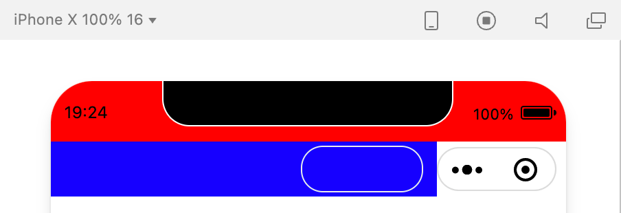

## 背景
微信小程序作为前端生态中举足轻重的一员，从发布开始，就受到了广大前端开发者的青睐。随着官方的大力推广和流量的剧增，小程序在业务侧的地位也逐渐增重，不少产品甚至逐步将重心转移到了小程序。  
而对于小程序的界面和交互设计，很多人的思维都受到了H5和App的影响，甚至有的产品经理和设计师会直接扔过来一份app的原型和设计图，你说不能用吧，说到底也都是移动端，凑合着也能用；你说都能用吧，真的想问问设计师有没有试着把右上角的胶囊按钮放上去，看看会对当前的设计稿产生怎样的影响。  
其实作为一个框架（或者说是一套规范），我们最终的产物是要提交给官方并运行在微信中的，这就要求我们的设计和交互要尽量向微信生态体系看齐，符合用户操作习惯、不产生割裂感的设计更容易建立友好、高效、一致的用户体验，我相信微信的设计团队比我们更懂这一点。  
尽管如此，特殊的业务场景下，我们仍然需要打破这种“规范”，去做一些定制，比如今天要说的“胶囊按钮”（入题略显牵强，尴尬中...），用过微信小程序的应该都知道，右上角有一个类似胶囊状的按钮，层级很高。胶囊中包含两个按钮，一个是关闭按钮，另外一个类似“更多”按钮。我们今天要做的就是做一个一样的“胶囊”出来。

## 需求分析
小程序的所有页面，包括小程序内嵌网页和插件，微信都会在其右上角放置官方小程序菜单，样式如图。开发者不可对其内容自定义，但可选择深浅两种基本配色以适应页面设计风格。 官方小程序菜单将放置在界面固定位置，开发者在设计界面时请预留出该区域空间，若需要在此区域附近放置可交互元素，要特别注意交互事件是否会冲突，操作是否容易被使用。

可以看到，绿色区域是我们可以操控的区域，做一个胶囊按钮的话，放在原来的位置肯定不行啦，我们可以放在跟原生按钮同一水平的位置，而同一水平位置是导航栏，再看下导航栏的布局：

不要被第4条给迷惑了，标题可以自定义的意思是可以更换标题文字，导航区可以自定义的意思是，整个把导航去掉，由开发者自己实现导航栏。这里发现了一个隐藏需求，**要想在导航栏上自定义按钮，就得先实现一个导航栏**（说的好像没说...）。实现导航栏的话又会涉及到兼容问题，如**刘海屏、水滴屏**等。实现自定义导航之后就可以开始做按钮了，怎样才能做的跟原生按钮大小、位置都一样呢（位置保持在同一水平），那就需要获取原生按钮的尺寸和位置了。通过`wx.getMenuButtonBoundingClientRect`可以达到目的。这样的话，需求就很明确了：
- 实现一个自定义导航栏
  - 设置`navigationStyle`为`custom`
  - 获取原生导航栏的高度（要做就做一样嘛）
  - 获取各机型“非安全区域”，如刘海屏被遮住的部分，填充该区域，防止导航内容区域被遮挡
- 通过`wx.getMenuButtonBoundingClientRect`获取胶囊按钮的布局位置信息
  - 基础库`2.1.0`开始支持，低版本需做兼容处理，这个基础库版本已经能覆盖绝大多数用户了
  - `width`、`height`，宽度、高度，单位`px`，在各尺寸机型下大小是相同的
  - `top`、`bottom`、`left`、`right`，上下左右边界坐标

## 从零开始，创建一个项目
打开微信开发者工具，选择小程序项目-代码片段，创建代码片段。  
代码片段是一种迷你、可分享的小程序或小游戏项目，可用于分享小程序和小游戏的开发经验、展示组件和 API 的使用、复现开发问题和 Bug 等。可点击以下链接查看代码片段的详细文档：
[https://mp.weixin.qq.com/debug/wxadoc/dev/devtools/devtools.html](https://mp.weixin.qq.com/debug/wxadoc/dev/devtools/devtools.html)

## 实现自定义胶囊按钮
**由于自定义按钮被包含在导航栏中，而实现导航栏又依赖原生胶囊的一些尺寸信息，所以考虑先实现自定义按钮**
### 获取原生胶囊布局位置信息
```js
const capsuleInfo = wx.getMenuButtonBoundingClientRect();
console.log(capsuleInfo);
```

- `width`、`height`，宽高，单位`px`
- `top`，胶囊上边界距离屏幕可视区域**上**边界距离，单位`px`
- `bottom`，胶囊下边界距离屏幕可视区域**上**边界距离，单位`px`
- `left`，胶囊左边界距离屏幕可视区域**左**边界距离，单位`px`
- `right`，胶囊右边界距离屏幕可视区域**左**边界距离，单位`px`


### 接下来就可以开始动手实现了
使用`view`标签创建视图节点
```html
<view class="capsule"></view>
```
按钮样式
```css
.capsule {
    width: 87px;
    height: 32px;
    border: 1rpx solid #EBEBEB;
    border-radius: 16px;
    margin-top: 30px;/** 临时代码，避免被左上角文字遮住 */
}
```

可以看到一个胶囊状的按钮出现了，但是有个问题，边框颜色和边框粗细的值是没有办法得到的，颜色吸一下，粗细使用`1rpx`让系统去自适应。  
至此，胶囊按钮已经实现了（按钮中具体要显示什么内容，是文字还是图标，就看实际业务了）。而按钮的位置，需要基于自定义导航栏来约束。

## 实现自定义导航栏
### 设置`navigationStyle`为`custom`
找到`app.json`文件，在`window`字段下，将`navigationStyle`的值设置为`custom`，可以看到导航栏消失了，页面整个顶上去了。

**注意：如果是小程序项目，这样设置的话会在全局范围内起作用，所有页面都会变成这样，如需对单个页面设置，可在该页面的json文件中单独设置**
### 获取导航栏内容区域的尺寸
- 宽度，需要将原生按钮的位置留出来，否则右侧内容会被按钮遮挡。除去按钮宽度和按钮右侧边距，即为导航内容区域宽度。而通过`wx.getMenuButtonBoundingClientRect`获取到的`left`是按钮坐边界距离屏幕可视区域左边界的距离，完美满足要求。
- 高度，在导航栏内容区域中，胶囊按钮是垂直居中的，`top`表示按钮上边界距离屏幕可视区域上边界的距离，但我们要的不是这个`top`，我们要的应该是距离导航内容区域上边界的距离，根据上面对胶囊按钮位置的分析，`top`由两部分组成，`statusbar`和我们真正需要的“top”，而`statusbar`怎么获取呢？
```js
const systemInfo = wx.getSystemInfoSync();
console.log(systemInfo);
```

则`realTop = top - systemInfo.statusBarHeight`，由于胶囊按钮在导航内容区域内是垂直居中的，则导航内容区域的高度为：`height = capsuleInfo.height + realTop * 2`。
### 绘制导航栏可视区域
```html
<view class="nav"></view>
```
```css
.nav {
    /** iPhone6/7/8 */
    width: 320px;
    height: 40px;
    background-color: blue;
}
```

歪到美国去了...   
### 调整布局，区分`statusBar`和内容区域
因为我们绘制的是内容区域，而内容区域上方是`statusBar`，该区域没有内容，则内容区域就顶上去了。怎么办？拿空白元素填充呗！   
修改一下布局，最外层元素是整个导航栏，内层包括状态栏和内容区域：
```html
<view class="nav">
    <view class="statusBar"></view>
    <view class="content"></view>
</view>
```
```css
.nav {}
.statusBar {
    height: 20px;
    background-color: red;
}
.content {
    width: 281px;
    height: 40px;
    background-color: blue;
}
```

内容区域已经绘制完成了，把按钮放进来看看效果：
```html
<view class="nav">
    <view class="statusBar"></view>
    <view class="content">
        <view class="capsule"></view>
    </view>
</view>
```
```css
.nav {}
.statusBar {
    height: 20px;
    background-color: red;
}
.content {
    width: 281px;
    height: 40px;
    display: flex;
    align-items: center;
    justify-content: flex-end;
    padding-right: 20rpx;
    box-sizing: border-box;
    background-color: blue;
}
.capsule {
    width: 87px;
    height: 32px;
    border: 1rpx solid #EBEBEB;
    border-radius: 16px;
}
```

有内味儿了吧...好，那我们切换机型试一下，来个刘海屏吧：

稀碎...哈哈，被刘海遮住了大部分，样式为啥了乱了呢？我们上面使用的尺寸都是基于`iPhone6/7/8`的，放到其他机型肯定不好使，所以必须动态获取。
### 样式兼容，动态获取位置及尺寸信息
```js
Page({
    data: {
        contentHeight: 0,
        systemInfo: {},
        capsuleInfo: {}
    },
    onLoad() {
        const systemInfo = wx.getSystemInfoSync();
        const capsuleInfo = wx.getMenuButtonBoundingClientRect();
        const realTop = capsuleInfo.top - systemInfo.statusBarHeight;
        const contentHeight = capsuleInfo.height + realTop * 2;
        this.setData({
            contentHeight, systemInfo, capsuleInfo
        });
    }
});
```
```html
<view class="nav">
    <view class="statusBar" style="height:{{systemInfo.statusBarHeight}}px"></view>
    <view class="content" style="width:{{capsuleInfo.left}}px;height:{{contentHeight}}px">
        <view class="capsule" style="width:{{capsuleInfo.width}}px;height:{{capsuleInfo.height}}px"></view>
    </view>
</view>
```
```css
.nav {}
.statusBar {
    background-color: red;
}
.content {
    display: flex;
    align-items: center;
    justify-content: flex-end;
    padding-right: 20rpx;
    box-sizing: border-box;
    background-color: blue;
}
.capsule {
    border: 1rpx solid #EBEBEB;
    border-radius: 16px;
}
```

刘海屏也OK了，切换机型看看也是没有问题的。  
不行，样式太丑了，把背景色去掉，在最外层容器统一设置。来个`lightblue`看一看。


## 总结
**好啦，大致就是这个样子了，当然也可以进一步封装为组件，有以下注意事项：**
- 背景色由外层统一传入，注意结合原生胶囊按钮的主题，保证风格的统一
- 可以对内容区域再次进行区域划分，最左侧是按钮区域，放返回或`Home`键，中间是标题区域，右侧是这个该死的自定义胶囊，注意各区域最大宽度
- 导航栏中的返回按钮可以绑定事件，而原生导航中的返回键是不提供回调函数的
- 导航整体层级应该是高于页面的，应该设置`position: fixed`
- 使用自定义导航的页面，需要注意页面顶部留出导航的空间，否则页面会顶上去
- 自定义导航都有了，这还不是想干啥就干啥了，比如加个双击导航返回顶部等