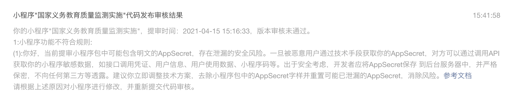
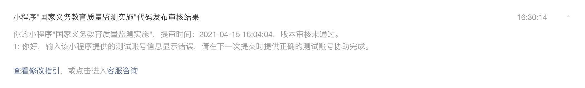
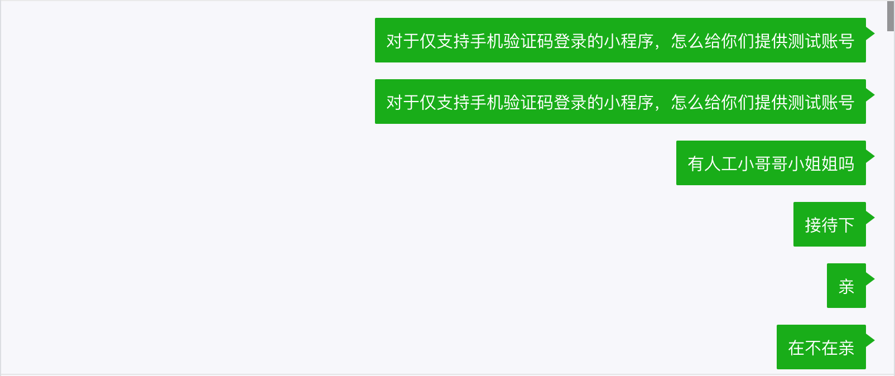
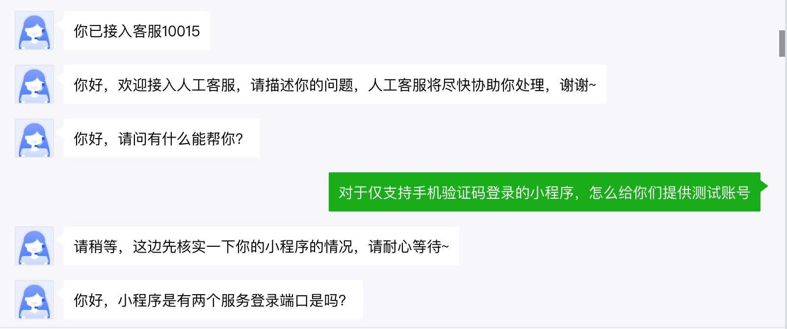
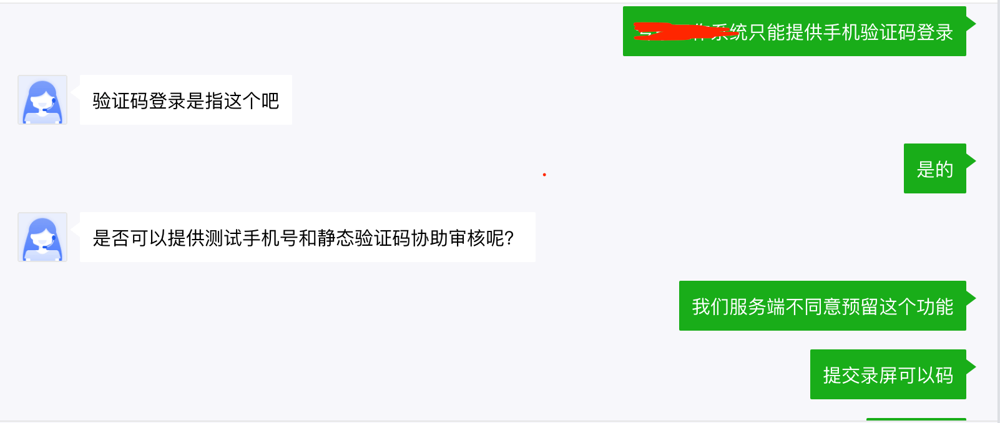
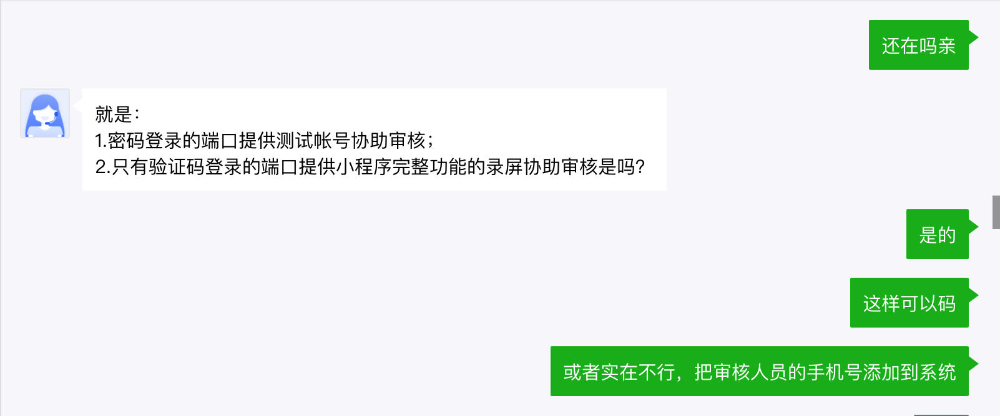
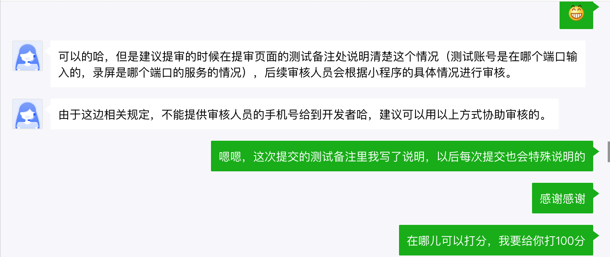
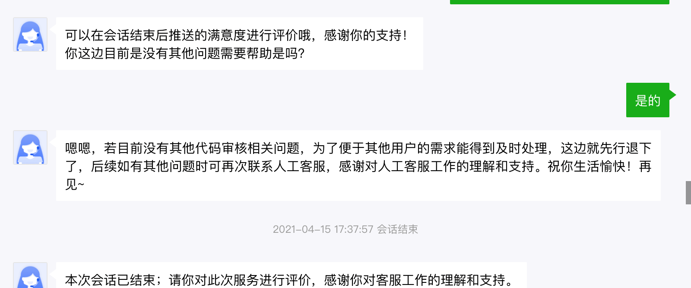

## 测试通过啦，bug改完了，ok，准提提审~_~

话说审核反馈还是挺快的，就是没通过，反馈信息很明确，说代码里可能包含了明文的`appSecret`，这个东西还是很敏感的，配合`appId`可调用非常敏感的接口，一旦泄漏，造成的安全隐患是非常严重的。而且`appSecret`只能线下保存，为了方便，直接保存在代码里了，真是不应该。  
好的，找到它，干掉它，再次提审！

## 提供不了测试账号怎么搞？
### 填写提审信息
要填的项还是很多的，这里不再贴图了。像版本描述、应用截图这些都好搞，但由于这个小程序比较特殊，包含了两个子系统，其中一个系统是通过账号密码登录，另外一个只能通过手机验证码登录，而手机号都是后台导入的，后端同学又不同意提供静态手机号和验证码的后门，这就难搞了，试一试吧，反正不要钱。  
由于其中一个系统无法提供测试账号，而另外一个系统又具有某种私密性，于是我就抱着试一试的心态，在测试备注里写下：`由于系统私密性较高，无法提供测试账号，敬请谅解。`，抖了个小机灵，再次提交审核~~，结果又是打脸。

这下子真的头大了，使用账号密码登录的系统还好说，可以找后端同学内置一个测试号，使用手机验证码登录的可咋整。  
相信应该不止我自己遇到过这个问题，对于一些私密性或安全性要求较高，或者仅仅是内部使用的系统，有时候真的没法提供测试账号呀，一筹莫展之时，看到了`客服咨询`四个小字，发现事情还有转机。那就只能找客服小姐姐（没准也是个程序员，哈哈）唠唠了。

## 与客服沟通，找到解决方案
点击`客服咨询`，聊天窗口打开了，迎接我的却是个毫无感情色彩的机器人，在我的消息轰炸之下，终于同意给我转人工了，不废话，直接上图：

### 最终解决方案是：  
- 有账号密码的系统提供测试账号（还是逃不掉）；
- 只能手机号验证码登录的系统，提供正常流程的录屏，就是登录进去，把页面点一点。  
有客服小姐姐（我感觉应该是个小姐姐）的buf夹持，我满怀信心的再次点了提交，约莫半个多小时，系统提示审核通过了，然后提交发布，剩下的交给测试去回归吧。  

## 兑现承诺
说到必须要做到，聊天结束后，果断给了客服五星好评，中间没有任何犹豫...

## 总结
- 腾讯官方的审核速度还是很快的；
- 一定要仔细阅读提审要求，避免不必要的时间浪费，常见的审核不通过的案例文档中也会列举；
- 遇到一时解决不了的问题，可以问客服或者去社区找答案（我也是后来才发现，不少人吐槽测试账号这个问题，而且有人给了明确的方案，就是上面说的录屏，还是要多利用搜索引擎啊）；
- 心态要好，嘴要甜。