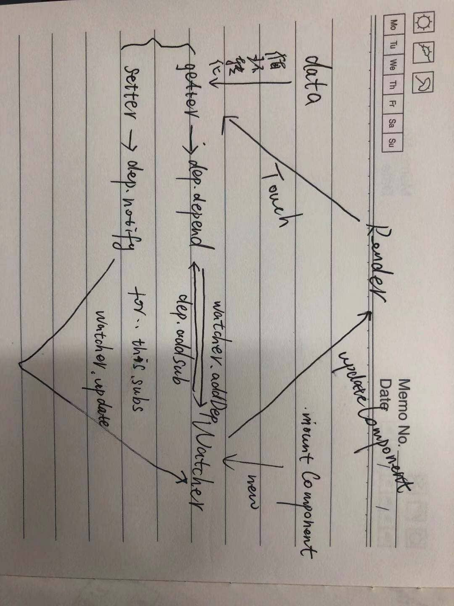

## 前言
作为目前最火的前端框架之一，`Vue.js`深受广大广大前端开发者的喜爱，且其上手简单、文档完善，社区也比较活跃，随着“Vue工程师”的需求量增加，不只前端工程师，很多后端、移动端同学也在或多或少的尝试`Vue.js`。  

```js
document.getElementById('id1').innerHTML = 'Hello word';
document.getElementById('id2').innerHTML = 'Hello word';
$('#id3').html('Hello word');
```
这样的代码能不能勾起你“美好”的回忆呢？然而在`Vue.js`中我们只需要这样做：
```js
this.name = 'luozhiyan';
this.$set(this.pserson, 'name', 'luozhiyan');
```
剩下的事情`Vue.js`会帮我们处理，页面上所有用到`name`、`person.name`的地方，都会在你修改数据之后自动更新。但你有没有想过，这整个过程是怎样的？为什么你修改数据会导致页面更新？`Vue`是如何“感知”这些变化的？带着疑问先去看下文档。

## 文档
> 现在是时候深入一下了！Vue 最独特的特性之一，是其非侵入性的响应式系统。数据模型仅仅是普通的 JavaScript 对象。而当你修改它们时，视图会进行更新。这使得状态管理非常简单直接，不过理解其工作原理同样重要，这样你可以避开一些常见的问题。在这个章节，我们将研究一下 Vue 响应式系统的底层的细节。[Vue.js文档 深入响应式原理](https://cn.vuejs.org/v2/guide/reactivity.html)

文档中针对响应式原理的解释已经很清晰了，整体思路就是在实例化Vue的时候，遍历`data`选项，并使用`Object.defineProperty`把`data`选项的属性转为用户不可见的`getter/setter`，同时每个组件都对应一个`watcher`实例，它会在组件渲染的过程中把“接触”过的数据 property 记录为依赖。之后当依赖项的 setter 触发时，会通知 watcher，从而使它关联的组件重新渲染。  
下面这张图从宏观角度解释了Vue的响应式流程：

需要注意，对于已经创建的实例，Vue 不允许动态添加根级别的响应式 property。但是，可以使用`Vue.set(object, propertyName, value)`方法向嵌套对象添加响应式 property。对于数组变化，Vue做了特殊处理，但仍然有不能检测到的变动，如：
- 当你利用索引直接设置一个数组项时，例如：`vm.items[indexOfItem] = newValue`
- 当你修改数组的长度时，例如：`vm.items.length = newLength`
以上内容，[官网](https://cn.vuejs.org/v2/guide/reactivity.html)有更详细的解释。

## 源码（Vue2.6.12）
只看文档就能够让我们对响应式原理有个大概的轮廓了，再给Vue官方点个赞。但如果想理解的更透彻，源码这一步是少不了的，看源码之前需要注意以下几点：

- 带着问题去看，比如我们现在的问题是要搞清楚响应式原理，就要针对性的去看`data`选项是如何被转为`getter/setter`的，依赖是如何收集的，数据变化后如何触发更新等

- 不要过多的关注跟问题无关的分支代码、异常处理等，以正常流程来看，必要时可适当配合断点调试来验证自己的猜想或疑问，Vue源码整体工程是很庞大的，逐行看的话代价太大，还很容易把自己绕进去，最后什么也没记住，反而忘了自己为什么要来看源码

- 再次强调，要把关注点放在我们要探究的问题上，把上面那张图暂时刻在脑海里，然后从源码中去验证它，把握响应式的整体流程，而非过多的关注细枝末节（当然并不是说细节不重要，只是要给自己的问题一个清晰的定位）

**这里最好是先把源码clone到本题，对着源码看会更清晰一些**

### 如何找到入口文件，找到Vue构造函数的定义
从`github`克隆代码(dev分支)之后，根目录的文件（夹）就非常多，一时很难决定从哪个文件夹开始，挨个找的又太浪费时间，你可能会按照习惯猜测应该从`src`文件夹开始，但总归是猜测，如果这是你的疑惑点的话，可以按照下面的方法来找，这个方法对多数库源码也是适用的（熟练工的话可以跳过）：

- 找到`package.json`文件，看`scripts`下的命令，非常多的命令，我们只需要看打包命令就可以了：
```json
...
"build": "node scripts/build.js",
"build:ssr": "npm run build -- web-runtime-cjs,web-server-renderer",
"build:weex": "npm run build -- weex",
...
```
真正执行打包的是`build`，而`build:ssr`和`build:weex`只是基于`build`传入了一些参数，通过`"build": "node scripts/build.js"`这个命令可以看出来执行的文件，即`scripts/build.js`

- 找到`scripts/build.js`文件，文件头部引入的都是一些函数、包，没有显式的引入源码里的文件，这时候就得看具体的代码了，怎么快速找到我们想要的信息呢？可以把所有的函数定义都折叠起来，看这个文件中调用了什么函数，则执行打包的函数就包含在里面
```js
...
build(builds)
function build (builds) {...}
function buildEntry (config) {...}
...
```
很明显这个`build`函数就是打包入口函数，然后看看它里面做了什么
```js
function build (builds) {
  let built = 0
  const total = builds.length
  const next = () => {
    buildEntry(builds[built]).then(() => {
      built++
      if (built < total) {
        next()
      }
    }).catch(logError)
  }

  next()
}
```
`entry`这个词是不是很熟悉，我们通常使用它来标记入口（如webpack配置文件中的`entry`属性），`buildEntry`函数以`builds`数组（这时候已经能看出来是个数组了）中的项为参数，这时候就要看看`builds`是什么东西了。找到`builds`的定义
```js
let builds = require('./config').getAllBuilds()
```

- 找到`scripts/config.js`文件，找到`builds`的定义，相信你一眼就能看出来，它就是不同打包产物的配置信息。`entry-runtime.js`和`entry-runtime-with-compiler.js`，是Vue的运行时版和完整版，相差了一个模板编译功能，不过对我们今天要探究的问题没有影响。通过`resolve('web/entry-runtime.js')`和`resolve`函数，相信你能找到`entry-runtime.js`文件的位置

- 找到`src/platforms/web/entry-runtime.js`文件，文件内容很简单
```js
/* @flow */
import Vue from './runtime/index'
export default Vue
```
就是引入并导出Vue，其实看`src/platforms/web/entry-runtime-with-compiler.js`也是一样的，是从同一个位置导入的Vue。终于看到构造函数的影子了，小开心一下吧。

- 找到`src/platforms/web/runtime/index.js`，这里仍然没有Vue的定义
```js
/* @flow */
import Vue from 'core/index'
...
```

- 找到`src/core/index.js`（至于为什么使用`'core/index'`可以找到，可以看一下ES6的模块路径查找规则），这个文件里依然没有Vue定义
```js
import Vue from './instance/index'
```
- 找到`src/core/instance/index.js`文件，终于见到本尊了。构造函数定义之后，紧接着就是一系列的初始化函数调用，我们需要找到的是`_init`的定义。
```js
function Vue (options) {
  if (process.env.NODE_ENV !== 'production' &&
    !(this instanceof Vue)
  ) {
    warn('Vue is a constructor and should be called with the `new` keyword')
  }
  this._init(options)
}
initMixin(Vue)
stateMixin(Vue)
eventsMixin(Vue)
lifecycleMixin(Vue)
renderMixin(Vue)
```
在`initMixin`函数中，我们找到了`_init`函数的定义，Vue就是在这里完成的初始化操作
```js
export function initMixin (Vue: Class<Component>) {
  Vue.prototype._init = function (options?: Object) {
    const vm: Component = this
    // ...
    vm._self = vm
    initLifecycle(vm)
    initEvents(vm)
    initRender(vm)
    callHook(vm, 'beforeCreate')
    initInjections(vm) // resolve injections before data/props
    initState(vm)
    initProvide(vm) // resolve provide after data/props
    callHook(vm, 'created')
    // ...
  }
}
```
`_init`函数中进行了一系列的初始化，函数命名还是很语义化的，根据名称就能猜出个大概，而这里我们也可以看到初始化过程中触发的钩子函数`callHook(vm, 'beforeCreate')`、`callHook(vm, 'created')`。

### `data`何时、如何转为`getter/setter`
通过`initState`函数一步步往下找，注意选择性的忽略一些异常处理、环境判断等代码，按正常流程，关注和我们的问题相关的代码。
```js
// src/core/instance/state.js
export function initState (vm: Component) {
  // ...
  initData(vm)
  // ...
}

// src/core/instance/state.js
function initData (vm: Component) {
  // 这个data就是我们实例化Vue的时候传入的data选项
  let data = vm.$options.data
  observe(data, true /* asRootData */)
}

// src/core/observer/index.js
export function observe (value: any, asRootData: ?boolean): Observer | void {
  // ...
  ob = new Observer(value)
  // ...
  return ob
}

// src/core/observer/index.js
export class Observer {
  constructor (value: any) {
    // ...
    this.walk(value)
    // ...
  }
  walk (obj: Object) {
    const keys = Object.keys(obj)
    // 遍历data的所有属性，使用defineReactive函数进行数据劫持
    for (let i = 0; i < keys.length; i++) {
      defineReactive(obj, keys[i])
    }
  }
  // ...
}

// src/core/observer/index.js
export function defineReactive (
  obj: Object,
  key: string,
  val: any,
  customSetter?: ?Function,
  shallow?: boolean
) {
  const dep = new Dep()
  Object.defineProperty(obj, key, {
    enumerable: true,
    configurable: true,
    get: function reactiveGetter () {
      // ...
    //   收集依赖
      dep.depend()
      // ...
    },
    set: function reactiveSetter (newVal) {
      // ...
    //   通知更新
      dep.notify()
    }
  })
}
```
至此，你应该知道了`data`是如何被转为`getter/setter`的，对于`data`中的每一个属性，Vue都会对其做响应式处理，也就是自定义`getter/setter`，所有对某属性的访问都会触发该属性的`getter`，从而触发依赖收集`dep.depend()`，而对某属性的赋值而产生的变化，就会触发该属性的`setter`，从而通知依赖更新`dep.nofity`。

### 依赖是怎么收集的，更新又是怎么通知的？
这就必须要说一下`Dep`类和`Watcher`类了。  
```js
// src/core/observer/dep.js
export default class Dep {
  static target: ?Watcher;
  id: number;
  subs: Array<Watcher>;

  constructor () {
    this.id = uid++
    this.subs = []
  }
  depend () {
    if (Dep.target) {
      Dep.target.addDep(this)
    }
  }
  notify () {
    const subs = this.subs.slice()
    for (let i = 0, l = subs.length; i < l; i++) {
      subs[i].update()
    }
  }
}
// Watcher类的代码太多，这里就不贴了
```
**之前说过每个Vue组件都会对应一个`watcher`实例，这个`watcher`在组件挂载的时候实例化，并传入`updateComponent`作为回调函数，这个`watcher`负责整个组件的“观察”（其实是对`data`、`props`，`computed`和`watch`做了另外的处理）。**
```js
// src/core/instance/lifecycle.js 197行
new Watcher(vm, updateComponent, noop, {
    before () {
      if (vm._isMounted && !vm._isDestroyed) {
        callHook(vm, 'beforeUpdate')
      }
    }
}, true /* isRenderWatcher */)
```
**`Dep`在收集依赖（`dep.depend()`）的时候，会调用当前组件`watcher`的`addDep`方法，并将`dep`实例作为参数传入，`Dep.target`指向的就是当前组件的`watcher`，`src/core/observer/dep.js`中定义了`pushTarget`和`popTarget`方法，目的就是将`Dep.target`指向当前`watcher`。`Dep`在收集依赖的时候，并不会主动理会是为在谁收集，而是直接去`Dep.target`静态属性中去取，任何一个`watcher`想让`Dep`为自己收集依赖，则必须使用`pushTarget`来通知`Dep`，之后调用`popTarget`“让位”。**
```js
depend () {
    if (Dep.target) {
      Dep.target.addDep(this)
    }
}
```
**而`addDep`方法做过一些处理（这些处理跟本次问题无关）之后，会再调用`dep.addSub(this)`，将这个`watcher`添加到`dep`的`subs`数组中，这样一来，负责收集依赖的`Dep`就和当前组件的`watcher`建立了联系。**
```js
// src/core/observer/watcher.js
addDep (dep: Dep) {
    const id = dep.id
    if (!this.newDepIds.has(id)) {
      this.newDepIds.add(id)
      this.newDeps.push(dep)
      if (!this.depIds.has(id)) {
        dep.addSub(this)
      }
    }
}
// src/core/observer/dep.js
addSub (sub: Watcher) {
    this.subs.push(sub)
}
```
**当`data`属性的`setter`被触发导致数据变化的时候，会嗲用`dep.notify()`，其实就是循环调用`subs`数组成员的`update`方法，而`subs`数组的成员就是组件的`watcher`，看下`update`方法：**
```js
update () {
    /* istanbul ignore else */
    if (this.lazy) {
      this.dirty = true
    } else if (this.sync) {
      this.run()
    } else {
      //关注这个就可以了
      queueWatcher(this)
    }
}
```
**`queueWatcher`会将当前`watcher`推入异步更新队列，通过`nextTick`函数在下一个`tick`更新dom。异步更新队列中的任务执行时，会调用`watcher`的`run`方法，通过一系列的方法调用（`watcher.run`、`watcher.get`），最终调用实例化`watcher`时传入的`expOrFn`和`cb`，还记得组件挂载后实例化`watcher`时传入的参数吗？`updateComponent`作为`expOrFn`参数传入，并且传入了一个`before`函数，用来触发`beforeUpdate`钩子，从头到尾都没有处理任何一个具体的属性，仅仅是通知了需要更新的组件，这也印证了：Vue的响应式更新是组件级别的。**

### 你能把官方文档上的响应式原理图再细化一下吗？
不看源码的话，就不会知道有`Dep`这么个东西了吧，那么你能把`Dep`的功能加到官网那张图上吗？尝试一下吧，有什么想法也可以给我留言。后面有时间的话我也会尝试一下，把图补上来。草图为证：


## 消化吸收
洋洋洒洒这么一大篇，虽然我在很努力的把自己的理解表达出来，但文字功底实在有限。鉴于本次的目的是搞清楚响应式流程，所以很多细节都忽略了，你如果有时间的话，可以在这篇博客的基础上，再把代码细看一下，相信你会很有收获。如果你发现这篇文章有什么错误、不足或者需要改进的地方，欢迎留言讨论。